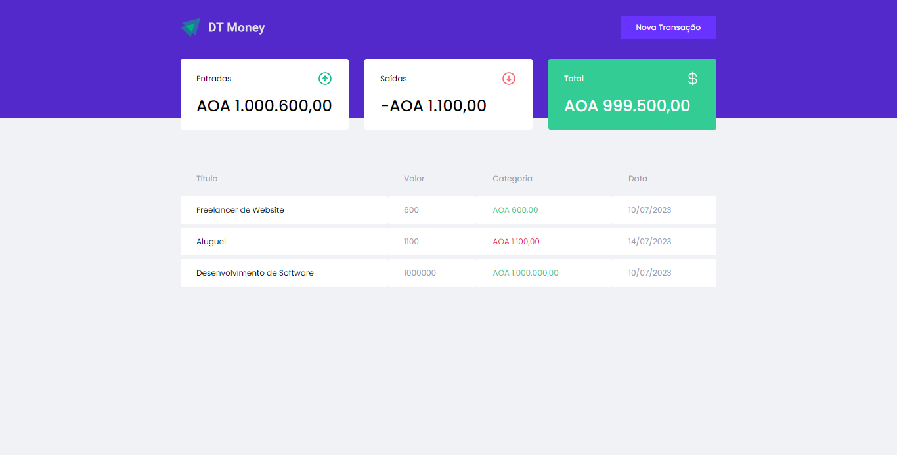

# IGNITE 
 ### DT-MONEY

 💻 Projecto

O DT-MONEY, é uma aplicação de controle financeiro, onde é possível cadastrar e controlar as transações feitas e ver o saldo💰

 🚀  Tecnologias usadas no projecto
   #### Esse projecto foi desenvolvido com as seguintes tecnologias:

* REACTJS

* TYPESCRIPT 

* STYLED-COMPONENTS

* MIRAGEJS 

🔖 Layout do projecto 

Link Demo: https://corde177.github.io/maratona-discover/

 
